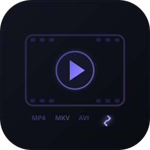
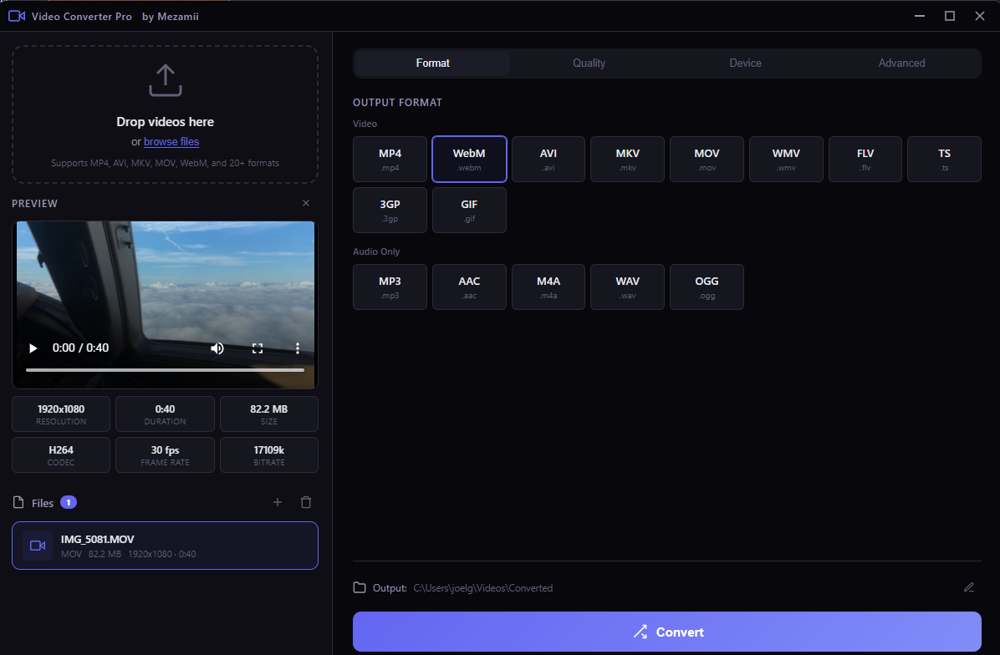

<p align="center">
  
</p>

<h1 align="center">Video Converter Pro</h1>

<p align="center">
  <strong>Free &amp; Portable Video Converter for Windows, macOS &amp; Linux</strong><br>
  Convert, compress &amp; optimize videos for any device. No install required.
</p>

<p align="center">
  <a href="https://github.com/CadiCod/video-converter-pro/releases/latest"></a>
  
  <a href="https://github.com/CadiCod/video-converter-pro/releases"></a>
  
</p>

<p align="center">
  <a href="https://github.com/CadiCod/video-converter-pro/releases/latest">
    
  </a>
  &nbsp;
  <a href="https://convert.mezamii.com/">
    
  </a>
  &nbsp;
  <a href="https://convert.mezamii.com/web/">
    
  </a>
</p>

---

<p align="center">
  
</p>

## Features

| | Feature | Description |
|---|---|---|
| 🎬 | **20+ Formats** | MP4, MKV, AVI, MOV, WebM, WMV, FLV, TS, M4V, 3GP, and more |
| 📱 | **Device Profiles** | One-click optimization for iPhone, Android, YouTube, Instagram, TikTok, WhatsApp, 4K TV |
| 📦 | **Batch Convert** | Convert multiple files at once with real-time progress tracking |
| 🗜️ | **Smart Compression** | CRF-based encoding reduces file size without visible quality loss |
| 🎵 | **Audio Extraction** | Extract audio as MP3, AAC, WAV, OGG, or M4A |
| 💾 | **Portable** | No installation required — just download, run, and convert |

## Supported Formats

### Video

| Input & Output | Output Only |
|---|---|
| MP4, MKV, AVI, MOV, WebM | GIF |
| WMV, FLV, TS, M4V, 3GP | |
| MPG/MPEG, OGV, ASF | |

### Audio Extraction

| Format | Codec |
|---|---|
| MP3 | LAME MP3 |
| AAC | AAC-LC |
| WAV | PCM 16-bit |
| OGG | Vorbis |
| M4A | AAC-LC |

## Device Profiles

| Profile | Resolution | Codec | Use Case |
|---|---|---|---|
| Universal | Original | H.264 Baseline | Maximum compatibility |
| iPhone/iPad | 1080p | H.264 High | Apple devices |
| Android | 1080p | H.264 Main | Android devices |
| YouTube | 1080p | H.264 High | YouTube uploads |
| Instagram | 1080p | H.264 High | Instagram posts & reels |
| TikTok | 1080p | H.264 High | TikTok videos |
| Twitter/X | 720p | H.264 Baseline | Twitter video posts |
| WhatsApp | 480p | H.264 Baseline | Small, compatible files |
| 4K TV | 2160p | H.264 High | Full UHD quality |

## Quality Presets

| Preset | CRF | Audio | Best For |
|---|---|---|---|
| Maximum | 16 | 320k | Archival, near-lossless quality |
| High | 20 | 192k | Professional use, excellent quality |
| Balanced | 23 | 128k | General use (default) |
| Compact | 28 | 96k | Sharing, smaller files |
| Minimum | 35 | 64k | Email, minimal storage |

## How to Use

1. **Add Videos** — Drag & drop files or click "Browse Files"
2. **Choose Format** — Select output format (MP4 recommended)
3. **Set Quality** — Pick a quality preset or device profile
4. **Convert** — Click Convert and watch the progress

## Download

### Pre-Built Portable Executable

👉 **[Download for Windows](https://github.com/CadiCod/video-converter-pro/releases/latest)** — No install needed, just run the .exe

**System Requirements:**
- Windows 10 or later (64-bit)
- 200 MB disk space
- No additional software needed (FFmpeg is bundled)

### Run from Source

```bash
# Clone the repository
git clone https://github.com/CadiCod/video-converter-pro.git
cd video-converter-pro

# Install dependencies
npm install

# Start the application
npm start
```

**Quick launchers:** `start.bat` (Windows) · `start.sh` (macOS/Linux)

### Build from Source

```bash
# Generate app icons from SVG
npm run generate:icons

# Build Windows portable .exe
npm run build:win

# Build macOS .dmg
npm run build:mac

# Build Linux AppImage
npm run build:linux
```

Built files go to the `dist/` folder.

## Web Version (PWA)

**[Try it online at convert.mezamii.com/web/](https://convert.mezamii.com/web/)** — no download needed!

- Runs entirely in your browser using **FFmpeg WebAssembly**
- No file uploads — your videos never leave your device
- Installable as a PWA on iPhone, Android, or desktop
- Supports 20+ formats, device profiles, and audio extraction

## Technology

- **[Electron](https://www.electronjs.org/)** — Cross-platform desktop framework
- **[FFmpeg](https://ffmpeg.org/)** — Industry-standard video processing engine (also via WASM for web)
- **[ffmpeg.wasm](https://ffmpegwasm.netlify.app/)** — FFmpeg compiled to WebAssembly for browser use
- **H.264 + AAC** — Maximum device compatibility
- **CRF Encoding** — Constant quality, variable bitrate compression
- **PWA** — Progressive Web App, installable on any device

## License

MIT License — free for personal and commercial use.

---

## About Mezamii

**Video Converter Pro** is built by [**Mezamii SAS**](https://mezamii.com?utm_source=github&utm_medium=readme&utm_campaign=about_section) — an all-in-one platform to **create, host, and sell online courses**.

If you're a creator, teacher, or entrepreneur looking to monetize your knowledge, check out Mezamii:

- 🎓 **Course Builder** — Create beautiful courses with video, text, and quizzes
- 💳 **Payment Processing** — Accept payments and manage subscriptions
- 👥 **Student Management** — Track progress and engagement
- 🎨 **Custom Branding** — Your brand, your platform

<p align="center">
  <a href="https://mezamii.com?utm_source=github&utm_medium=readme&utm_campaign=cta_button">
    
  </a>
</p>
